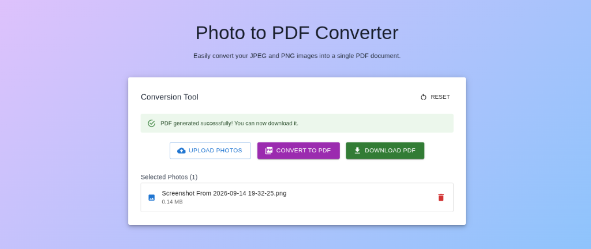

# 🛠️ Client-Side Document Conversion Tool

A fast, secure, and privacy-focused web application that allows users to convert files directly in their browser. Built with modern web technologies to ensure your sensitive documents never leave your device.

**🌍 Live Demo:** [https://your-deployment-link-here.vercel.app](https://your-deployment-link-here.vercel.app)

## 📸 Demo



## ✨ Features

- **🖼️ Photo to PDF**: Convert one or multiple JPEG/PNG images into a single, perfectly scaled PDF document.
- **📝 Word to PDF**: Extract text from `.docx` files and generate a formatted PDF document.
- **📄 PDF to Word**: Extract text from PDF files and generate a `.docx` Microsoft Word document.
- **🔒 100% Client-Side**: All conversions happen securely inside your browser. No files are ever uploaded, sent, or saved to an external server, ensuring complete data privacy and lightning-fast speeds.
- **🎨 Modern UI**: A clean, responsive, and intuitive interface powered by Material-UI and styled with Tailwind CSS.

## 🚀 Tech Stack

- **Framework**: [Next.js 14](https://nextjs.org/) (React App Router)
- **Styling**: [Tailwind CSS](https://tailwindcss.com/)
- **UI Components**: [Material-UI (MUI)](https://mui.com/)
- **PDF Generation**: [jsPDF](https://github.com/parallax/jsPDF)
- **Word Parsing**: [Mammoth.js](https://github.com/mwilliamson/mammoth.js)
- **PDF Parsing**: [PDF.js (pdfjs-dist)](https://mozilla.github.io/pdf.js/)
- **Word Generation**: [docx](https://docx.js.org/)

## 💻 Getting Started

Follow these instructions to run the project locally on your machine.

### Prerequisites

- [Node.js](https://nodejs.org/) (v18 or higher recommended)
- npm (comes with Node.js)

### Installation

1. Clone the repository:
   ```bash
   git clone https://github.com/your-username/your-repo-name.git
   cd your-repo-name
   ```

2. Install the dependencies:
   ```bash
   npm install
   ```

3. Start the development server:
   ```bash
   npm run dev
   ```

4. Open [http://localhost:3000](http://localhost:3000) with your browser to see and use the application.


